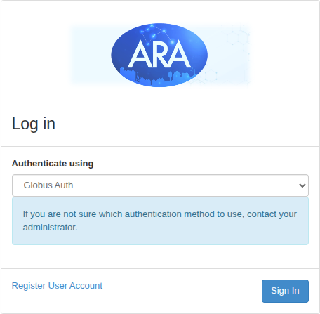
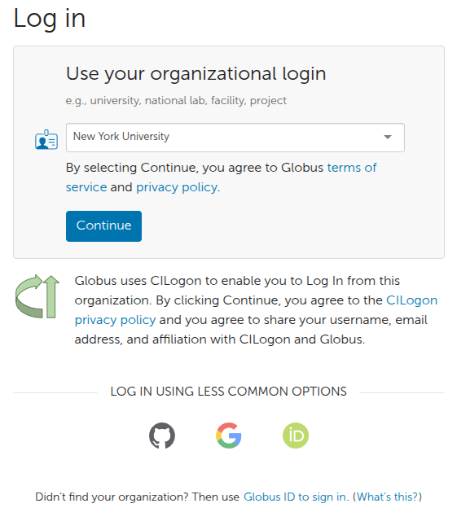
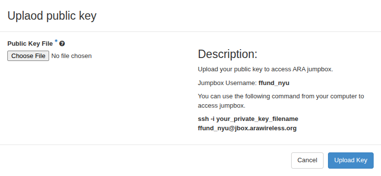
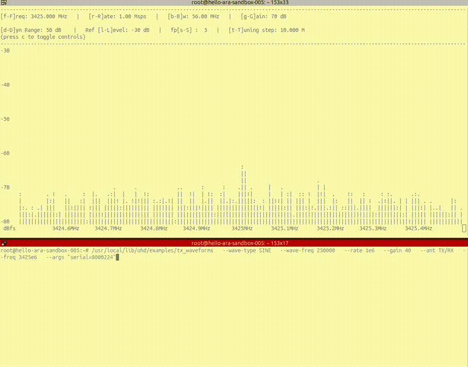

# Hello, ARA

ARA is a wireless research platform for experiments involving advanced wireless technologies (such as 5G).

ARA supports experiments in a controlled sandbox environment and in outdoor environments around the Iowa State campus in Ames, Iowa. In this tutorial you will create an account on ARA and run an example experiment in the sandbox. 

In the example experiment, you will send a wireless signal with one radio, receive it with another radio, and visualize the received signal power.


>[!NOTE]
>Before your start: You need to be added to an ARA project by your advisor or instructor! Your advisor or instructor should have already set up a project and added your email address to the list of project users.

## Prepare your workstation 

To use ARA, you'll need to prepare your workstation (the laptop or PC you are going to use for your experiments) with a terminal application.

You will need a terminal application with SSH to connect to your ARA resources. You may use the built-in terminal on Linux or Mac. On Windows, you may use [cmder](https://cmder.app/) or any other terminal application that has an SSH client.

#### Generate an SSH key

Next, you must generate SSH keys that you will later add to your ARA profile. You will use these keys when connecting to resources in ARA.

> Note: If you already have an SSH key pair, you can use it with ARA. Locate its public key file, which ends in `.pub`, then skip to the next section. If you do not have an SSH key pair, continue with the rest of this section.

SSH public-key authentication uses a pair of separate keys (i.e., a key pair): one “private” key, which you keep a secret, and the other “public”. A key pair has a special property: any message that is encrypted with your private key can only be decrypted with your public key, and any message that is encrypted with your public key can only be decrypted with your private key. 

This property can be exploited for authenticating login to a remote machine. First, you upload the public key to a special location on the remote machine. Then, when you want to log in to the machine: 

* You use a special argument with your SSH command to let your SSH application know that you are going to use a key, and the location of your private key. If the private key is protected by a passphrase, you may be prompted to enter the passphrase (this is not a password for the remote machine, though).
* The machine you are logging in to will ask your SSH client to “prove” that it owns the (secret) private key that matches an authorized public key. To do this, the machine will send a random message to you.
* Your SSH client will encrypt the random message with the private key and send it back to the remote machine.
* The remote machine will decrypt the message with your public key. If the decrypted message matches the message it sent you, it has “proof” that you are in possession of the private key for that key pair, and will grant you access (without using an account password on the remote machine.)

(Of course, this relies on you keeping your private key a secret.)

We’re going to generate a key pair on our laptop, then upload it to our ARA profile.

Open a terminal, and generate a key named `id_ed25519_ara`:

```
ssh-keygen -t ed25519 -f ~/.ssh/id_ed25519_ara
```

Follow the prompts to generate and save the key pair. The output should look something like this: 

```
$ ssh-keygen -t ed25519 -f ~/.ssh/id_ed25519_ara
Generating public/private ed25519 key pair.
Enter file in which to save the key (/users/ffund01/.ssh/id_ed25519_ara):
Enter passphrase (empty for no passphrase):
Enter same passphrase again: 
Your identification has been saved in /users/ffund01/.ssh/id_ed25519_ara.
Your public key has been saved in /users/ffund01/.ssh/id_ed25519_ara.pub.
The key fingerprint is:
SHA256:0s8rm6p0dy1xLrjTpEc1CemZLFnE1mBvD7ZkexJ1W2Q ffund01@example.com
The key's randomart image is:
+--[ED25519 256]--+
|      .o.        |
|      ..+        |
|     . + .       |
|      o S .      |
|     . +E+ .     |
|      o.=.+      |
|     .+*oB       |
|    .o+X+o       |
|    .+B*o.       |
+----[SHA256]-----+
```

If you use a passphrase, make a note of it somewhere safe! (You don’t have to use a passphrase, though - feel free to leave that empty for no passphrase.)

The command creates two files:

* `~/.ssh/id_ed25519_ara` is your private key. Keep it secret and do not upload it.
* `~/.ssh/id_ed25519_ara.pub` is your public key. You will upload this file to ARA.

You will also need the *contents* of your public key file, which you'll use whenever you start an experiment. Run

```
cat ~/.ssh/id_ed25519_ara.pub
```

The output will start with `ssh-ed25519`, e.g.

```
ssh-ed25519 AAAAC3NzaC1lZDI1NTE5AAAAIKsJ8MzC+ml/yEWbCsJJOqUENXumlhE+CYOvDkSI/Kk1 ffund@example.com
```

Copy the entire output.


## Set up your ARA account

Now that everything is set up on your workstation, it's time to log in to ARA. Open the [ARA Dashboard](https://portal.arawireless.org/). On the login page, choose an authentication method from the "Authenticate using" menu as follows:




1. Choose "Globus Auth", and click "Sign In".
2. On the Globus sign-in page, select your organization under "Use your organizational login", then click "Continue". (If your organization does not appear in the list but your university provides an institutional Google account, find "Log in using less common options" and click the Google icon. When Google asks you to choose an account, select your university-issued account. )
3. Log in with your institutional credentials.

>You must authenticate with an email address issued by your university. For example, an NYU student must use an `nyu.edu` address in order to be able to join an NYU project.

After authentication, Globus will return you to the ARA Dashboard.



> If it is not possible to log in with your institutional email address, your advisor or instructor may tell you to use Keystone authentication instead of Globus. In this case, they will also provide your ARA username *and password*. (Don't try to use Keystone unless you have been given a password by your advisor/instructor!) Select "Keystone Credentials" instead of "Globus Auth" in the authentication menu, enter those credentials, and click "Sign In".

#### Upload your public key

Next, you will need to upload the public part of your key pair to the ARA Dashboard, so that you will be able to use it to log on to ARA resources!

From the ARA dashboard,

1. Click your email address in the upper-right corner.
2. Select "Upload Public Key".
3. For "Public Key File", choose the public key file `~/.ssh/id_ed25519_ara.pub` from your computer. 
4. Click "Upload Key".



This page also shows your ARA jumpbox username and an example SSH command. Your username will differ from the one shown in the screenshot; use the username displayed in your own dashboard.

After you have uploaded a key, test it by connecting to the jumpbox. Run the command shown on the upload page, replacing the example identity filename with *your* ARA private key:

```
ssh -i ~/.ssh/id_ed25519_ara YOUR_USERNAME@jbox.arawireless.org
```

Use the username displayed in *your* dashboard in place of `YOUR_USERNAME`. The first time you connect, SSH may ask you to confirm the host key. Type `yes`, and press Enter. 

A successful connection will open a shell on the ARA jumpbox. Run 

```
exit
```

in this shell to return to your local terminal.## Start an experiment

Now, you are ready to run an experiment on ARA!

ARA provides a [sandbox](https://arawireless.readthedocs.io/en/latest/ara_technical_manual/sandbox_service.html) where you can test wireless experiments in a controlled lab environment. Each sandbox host from 001 through 025 is connected to two USRP B210 radios, so a reservation for one host gives you access to both radios.

In this "Hello, ARA" experiment, you will reserve one sandbox host, send a wireless signal with one radio, receive it with the other radio, and visualize the received signal power.

### Check resource availability

Before you create a reservation, identify a sandbox host that is available now and for the next few hours.

From the ARA dashboard,

1. In the menu on the left, click "Project > Summary > Overview".
2. Scroll down to the "Sandbox" section.
3. Find a sandbox host that shows "Available" in the "Reservable", "SDR 1", and "SDR 2" columns.

The "Reservable" column indicates whether you can reserve the host right now. The other two columns indicate whether both radios connected to that host are available. Make a note of the host name, e.g. `Sandbox-Host-001`.

Next, check that the host will remain available for the duration of your experiment:

1. In the menu on the left, click "Project > Reservations > Leases".
2. Click "Host Calendar" on the right side of the page.
3. Find the host you selected and confirm that it has no reservation for at least the next few hours.

If the host is reserved soon, return to the Resource Overview and choose another host.

### Create a lease and launch a container

We will use an "orchestration template" to reserve the sandbox host and launch a container on it. 

First, download the [`hello_ara_sandbox.yaml`](resources/hello_ara_sandbox.yaml) template to your computer.

In the ARA dashboard, go to `Project > Orchestration > Stacks` and click "Launch Stack". Upload the template. You will be asked to specify three parameters:

* For the stack name, use `hello-ara-USERNAME`, where `USERNAME` is the first part of your ARA username. For example, use `hello-ara-ffund` if your username is `ffund@nyu.edu`. 
* Specify the three-digit sandbox host number you identified earlier (e.g. `001`).
* Finally, paste in the full contents of your SSH public key.

Then, click "Launch".

> Sometimes, the stack may fail with an error message "Start Date Must Be Later Than Current Date". This can happen when the lease starts at the same minute that you submit the stack. If this happens, you can delete the stack and submit a new one!

When the stack status changes to "Create Complete", it will have created a "container" running on the sandbox host. You'll need its address in order to access it over SSH.

To find the floating IP associated with your container, open `Project > Container > Containers`, find your container (with the selected sandbox host number as part of its name!), and click on it to see an overview of the container details. On the right side, next to "Addresses", it will have an address in the form `10.189.X.Y` (for some `X` and `Y`) labeled as the "floating IP address". Make a note of this address.

> Sometimes, ARA may fail to automatically assign a floating IP to your container. If that happens, you can still assign one yourself! Make a note of the `10.0.4.X` address associated with your container. Then, in the ARA Portal, click on Network > Floating IPs. Click the "Allocate IP to Project" button, then "Allocate IP". Next to the newly added IP, click "Associate", and under "Portal to be Associated", select the `10.0.4.X` address associated with your container.

Then, in your terminal, use the floating IP shown there to connect through the jumpbox:

```
ssh -i ~/.ssh/id_ed25519_ara -J YOUR_USERNAME@jbox.arawireless.org root@FLOATING_IP
```

where you replace `YOUR_USERNAME` with the jumpbox username shown when you uploaded your public key, and replace `FLOATING_IP` with the floating IP from `container_addresses`.

### Verify radio hardware


After you connect to the container, verify that two radios are available:

```
uhd_find_devices
```

The output should list two USRP B210 radio devices. Make a note of the serial number for each device.

### Send a signal from one radio to another

Now we are ready to send a signal from one radio to another! Here is a brief demo of what we will see:




* First, a live view of what the receiver sees will show no meaningful transmission - just the "noise floor".
* Then, once we start the transmitter, the receiver will show a signal at a 250 kHz offset from the center.
* After we stop the transmitter, the signal will disappear and we will just see noise floor again.

You will need two SSH sessions: one for the transmitter, and one for the receiver. Use the same SSH command in a new terminal window to open a second SSH session.

In the first SSH session, start a receiver. Use the command below, but:

* in place of `DEVICE_0_SERIAL`, substitute the serial number shown in the output of `uhd_find_devices` for the *first* radio
* in place of `FREQUENCY_HZ`, use `3400 + 5 * HOST_NUMBER` followed by `e6`, where `HOST_NUMBER` is the sandbox host number you are using For example, host `002` uses `3410e6` (3410 MHz).

```bash
# runs on sandbox host
/usr/local/lib/uhd/examples/rx_ascii_art_dft \
  --step 10000000 \
  --num-bins 1024 \
  --rate 1e6 \
  --frame-rate 5 \
  --ref-lvl -30 \
  --dyn-rng 50 \
  --gain 70 \
  --ant RX2 \
  --freq FREQUENCY_HZ \
  --args "serial=DEVICE_0_SERIAL" 
```

You will see a live visualization of the received wireless signal power around the frequency you have specified. Leave this running.


In the second SSH session, transmit a wireless signal within that frequency range. Use the command below, but:

* in place of `DEVICE_1_SERIAL`, substitute the serial number shown in the output of `uhd_find_devices` for the *second* radio
* in place of `FREQUENCY_HZ`, use the same frequency you computed previously.

```bash
# runs on sandbox host
/usr/local/lib/uhd/examples/tx_waveforms \
  --wave-type SINE \
  --wave-freq 250000 \
  --rate 1e6 \
  --gain 40 \
  --ant TX/RX \
  --freq FREQUENCY_HZ \
  --args "serial=DEVICE_0_SERIAL" 
```

Once the transmitter starts, the receiver should show a peak near the transmitted 250 kHz offset (i.e. near the right side of the display). 


Press Ctrl+C in both sessions when finished.


## Clean up resources

Your experiment resources should automatically be deleted after two hours, but you can also manually delete anything that is left over:

* Under Project > Orchestration > Stacks, use the drop-down menu at the right side, next to your stack (the one with your name in it!) and "Delete Stack". 

Leave other resources - not associated with your experiment - alone. These belong to other users that are part of the same ARA "project" as you (e.g. your classmates or lab mates).